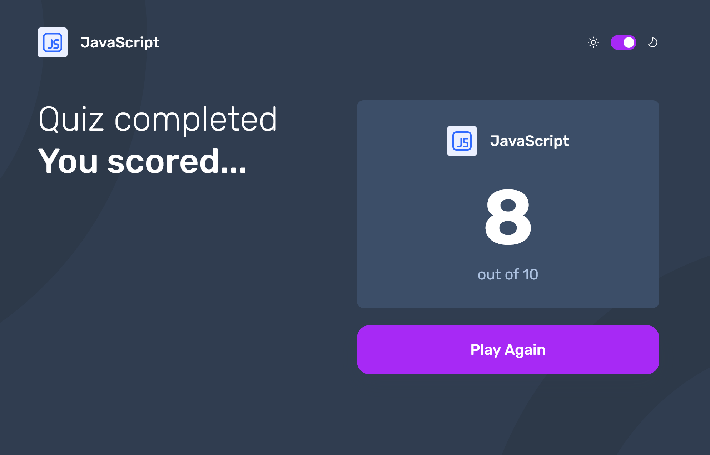

# Frontend Mentor - Frontend quiz app

This is a solution to the [Frontend quiz app challenge on Frontend Mentor](https://www.frontendmentor.io/challenges/frontend-quiz-app-BE7xkzXQnU). Frontend Mentor challenges help you improve your coding skills by building realistic projects.

## Table of contents

- [Overview](#overview)
  - [The challenge](#the-challenge)
  - [Screenshot](#screenshot)
  - [Links](#links)
- [My process](#my-process)
  - [Built with](#built-with)
  - [Project Notes](#project-notes)
  - [Continued development](#continued-development)
  - [Useful resources](#useful-resources)
- [Author](#author)
- [Acknowledgments](#acknowledgments)

## Overview

### The challenge

Users should be able to:

- Select a quiz subject
- Select a single answer from each question from a choice of four
- See an error message when trying to submit an answer without making a selection
- See if they have made a correct or incorrect choice when they submit an answer
- Move on to the next question after seeing the question result
- See a completed state with the score after the final question
- Play again to choose another subject
- View the optimal layout for the interface depending on their device's screen size
- See hover and focus states for all interactive elements on the page
- Navigate the entire app only using their keyboard
- Change the app's theme between light and dark

### Screenshot




### Links

- Solution URL: [Add solution URL here](https://www.frontendmentor.io/solutions/responsive-frontend-quiz-app-using-react-MUCSgOzyJV)
- Live Site URL: [Add live site URL here](https://ubiquitous-malasada-c772ef.netlify.app/)

## My process

### Built with

- Semantic HTML5 markup
- CSS custom properties
- Flexbox
- CSS Grid
- Mobile-first workflow
- [React](https://reactjs.org/) - JS library

Nothing groundbreaking with my CSS for this project. If I were to restart this project, I would likely use Tailwind for most of the styling as the design comp is fairly straightforward. However, as it stands, this project employs a basic pattern that I follow for most projects where I write the CSS from scratch: layers to help organize styles, heavy use of custom utility classes to enhance reusability, and leveraging newer CSS standards, such as nesting and simplified media query syntax.

```css
@layer layout {
  body {
    padding-inline: var(--spacing-150);

    @media (width > 37.5rem) {
      padding-inline: var(--spacing-400);
    }
  }
  .wrapper {
    max-width: var(--wrapper-max-width, 1160px);
    margin-inline: auto;
    padding-block: var(--wrapper-padding-block, var(--spacing-200));

    @media (width > 37.5rem) {
      --wrapper-padding-block: 0;
    }
  }

  .grid-columns {
    display: grid;

    @media (width > 64rem) {
      grid-template-columns: 1fr 1fr;
      gap: var(--spacing-200);
    }
  }

  .header-content {
    --wrapper-padding-block: var(--spacing-100);
    min-height: 72px;
    display: flex;
    align-items: center;
    justify-content: space-between;
    width: 100%;

    @media (width > 37.5rem) {
      --wrapper-padding-block: var(--spacing-250);
    }

    @media (width > 64rem) {
      --wrapper-padding-block: var(--spacing-500);
    }
  }
```

My core rendering logic with my App file started quite a bit more convoluted than where I ended up. I'm happy with what I feel is an easy-to-understand flow and dependencies with a minimal amount of prop drilling.

```js
return (
  <>
    <Header currentQuiz={currentQuiz} />
    <main>
      {view === 'welcome' && (
        <Welcome quizzes={quizzes} onSelect={startQuiz} />
      )}

      {view === 'quiz' && currentQuiz && (
        <Quiz
          quizTitle={currentQuiz.title}
          question={currentQuiz.questions[currentQuestionIndex]}
          questionIndex={currentQuestionIndex}
          totalQuestions={currentQuiz.questions.length}
          onAnswerSubmit={handleAnswerSubmit}
          isLastQuestion={
            currentQuestionIndex === currentQuiz.questions.length - 1
          }
        />
      )}

      {view === 'results' && currentQuiz && (
        <Results
          quiz={currentQuiz}
          score={score}
          totalQuestions={currentQuiz.questions.length}
          onRestart={resetQuiz}
        />
      )}
    </main>
  </>
);
```

I had a lot of fun developing the method of generating the multiple-choice answer buttons. There's a good deal of conditional logic here that's handling the various states and styles. Building upon this structure, I'd like to include even more accessibility-focused attributes to improve the app's overall usability.

```js
<div className="selection-container multiple-choice-answers">
  {question.options.map((option, index) => {
    const isSelected = selectedOption === option;
    const isAnswer = option === question.answer;
    const optionBtnClassName = clsx('button option-button', {
      selected: isSelected,
      correct: hasSubmitted && isAnswer,
      incorrect: hasSubmitted && !isAnswer && isSelected,
    });

    return (
      <Button
        key={`${option}-${index}`}
        onClick={() => handleSelectedOption(option)}
        isDisabled={hasSubmitted}
        className={optionBtnClassName}>
        <span className="option-letter">{letters[index]}</span>
        {option}
        {hasSubmitted && isSelected && !isAnswer && (
          
        )}
        {hasSubmitted && isAnswer && (
          
        )}
      </Button>
    );
  })}
</div>
```

### Continued development

Strictly speaking, this app did not need to be developed with React. In fact, this is the final project within the Frontend Masters JavaScript fundamentals path. But I've come to enjoy working with React so much that I didn't want to pass up an opportunity to keep practicing the craft. This was an extremely fun build and a project I'll certainly return to and build upon in the future.

### Useful resources

- [clsx utility](https://www.npmjs.com/package/clsx) - A handy utility for handling className strings conditionally. I've used it in several projects, and now it's a go-to resource for me.
- [Frontend Mentor Learning Pahts](https://www.frontendmentor.io/learning-paths/) - As noted in the intro, this is a Frontend Mentor design. I can't speak highly enough about the quality of the Frontend Mentor platform, and I think their learning paths are some of the best, most thoughtfully developed roadmaps and learning materials.
- [Brad Travery](https://www.traversymedia.com/modern-react-from-the-beginning) - I'm a big fan of Brad's courses and have taken several over the years. This recently released React course looks like Brad's typical top quality and a great option for anyone looking to get started with the JS library.

## Author

- Website - [Matt Pahuta](https://www.mattpahuta.com)
- Frontend Mentor - [@mattpahuta](https://www.frontendmentor.io/profile/MattPahuta)
- Bluesky - [@mattpahuta](https://bsky.app/profile/mattpahuta.bsky.social)
- LinkedIn - [Matt Pahuta](www.linkedin.com/in/mattpahuta)

## Acknowledgments

There is no way to heap enough praise on [Bob Ziroll](https://scrimba.com/@bobziroll) and [Josh Comeau](https://www.joshwcomeau.com/). When it comes to learning React and some of the trickier parts of web development, there are no people I turn to more frequently.
